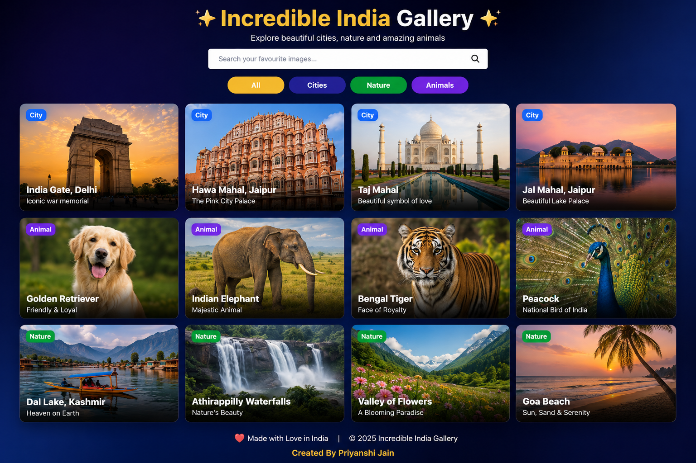
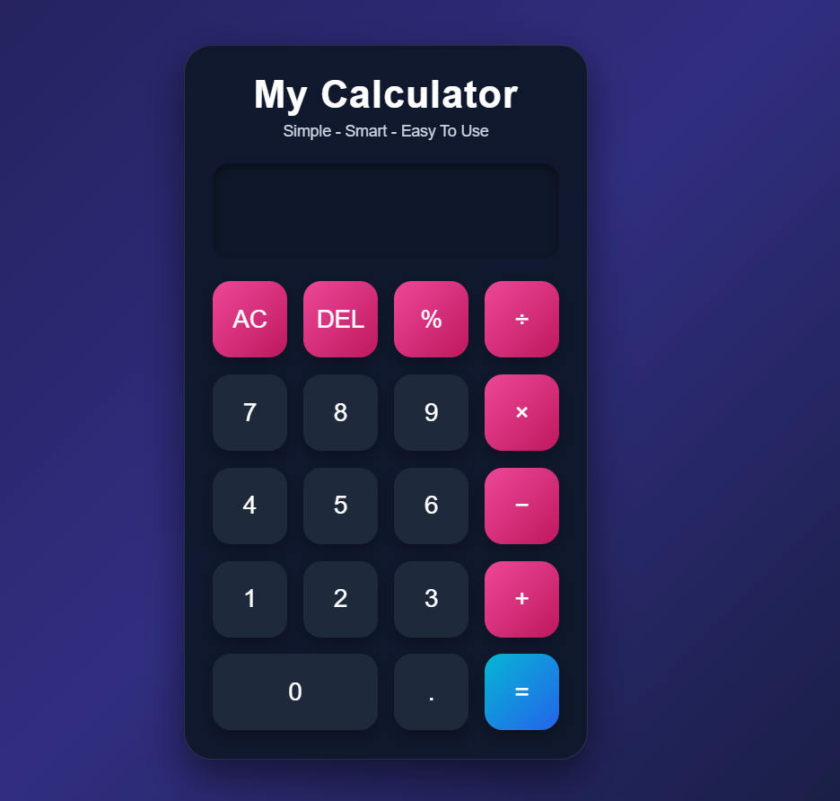
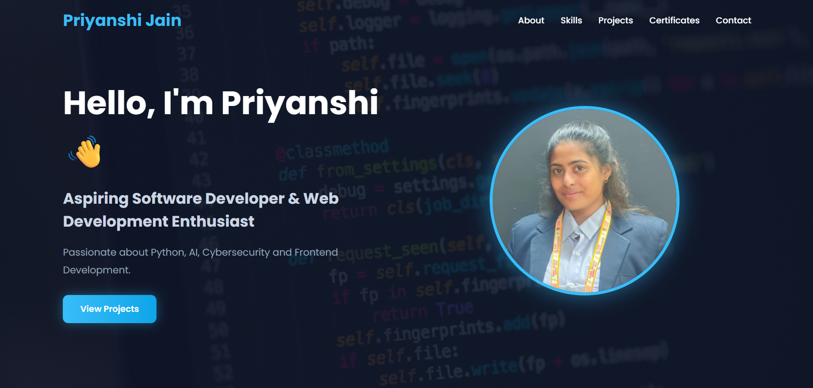

# 🚀 CodeAlpha Frontend Development Internship Projects

Welcome to my **Frontend Development Internship Projects** repository.  
This repository contains all the projects completed during the internship using **HTML, CSS, and JavaScript**.

---

# 📌 Projects Included

## 🖼️ 1. Image Gallery

A responsive and attractive image gallery website with beautiful hover effects and clean design.

### ✨ Features
- Responsive image layout
- Hover effects
- Clean UI
- Modern gallery design

### 🛠️ Technologies Used
- HTML5
- CSS3
- JavaScript

### 📸 Output



---

## 🧮 2. Calculator

A simple and functional calculator capable of performing basic arithmetic operations.

### ✨ Features
- Addition
- Subtraction
- Multiplication
- Division
- Responsive buttons layout
- Interactive interface

### 🛠️ Technologies Used
- HTML5
- CSS3
- JavaScript

### 📸 Output



---

## 💼 3. Personal Portfolio

A modern portfolio website to showcase profile, skills, and projects.

### ✨ Features
- Responsive design
- About section
- Skills section
- Contact section
- Attractive UI

### 🛠️ Technologies Used
- HTML5
- CSS3
- JavaScript

### 📸 Output



---

# 📂 Folder Structure

```bash
CodeAlpha_Frontend_Projects/
│
├── Calculator/
│
├── ImageGallery/
│
└── Priyanshi-Portfolio/
```

---

# ▶️ How to Run

## Step 1
Clone the repository

```bash
git clone https://github.com/your-username/CodeAlpha_Frontend_Projects.git
```

---

## Step 2
Open the project folder in VS Code.

---

## Step 3
Run the `index.html` file in your browser.

---

# 🎯 Internship

Frontend Development Internship by **CodeAlpha**

---

# 👩‍💻 Author

**Priyanshi Jain**

---

# ⭐ Acknowledgement

Thanks to **CodeAlpha** for providing this internship opportunity and helping me improve my frontend development skills.
